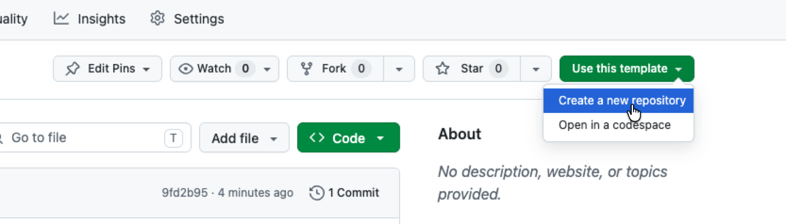

# EMI Coding Exercise

Welcome. This is the starter repo for the EMI junior developer coding exercise.

## First: don't fork - use the template

Click the green **Use this template** button at the top of the GitHub page, then **Create a new repository**. This gives you a clean repo of your own, with no link back to ours.



Once that's done, clone your new repo locally and carry on.

## Start here

1. Read **[`BRIEF.md`](./BRIEF.md)** - what to build, what we'll judge, what to deliver.
2. Look in **[`design-reference/`](./design-reference/)** - layout wireframes (`mockup.md`) and brand reference (`design-system.html`, open in a browser).

## Run it

```bash
npm install
npm run dev
```

You'll get a blank page with the words "Build me". That's the starting point.

## What's already wired up

- **Vite + React 19 + TypeScript** in strict mode.
- **Roboto** preconnected and linked in `index.html` (use it; the brand requires it).
- **`src/lib/types.ts`** - domain types for the Repair Event (extend or replace as you like).
- **`src/lib/seed.ts`** - sample data so the admin view has something to render from the start.
- **`src/lib/storage.ts`** - optional `localStorage` helper. Use it if you want persistence.

The styling is up to you. The brand palette, type weights, and component specs are in `design-reference/design-system.html` - read it, then bring the palette and type in however you like.

## What you'll add

The brief tells you the full scope. In rough order of priority:

- A tablet view: six milestone buttons + add-annotation buttons + a modal.
- An admin view: timeline + auto-calculated metrics.
- A header toggle to swap between them.

## Time

Around 2 hours of focused work. Don't grind it for a weekend.

## Questions

If something's unclear, make a sensible call and note it in your README when you submit. We'd rather see your judgement than a clarifying email.

Good luck.
